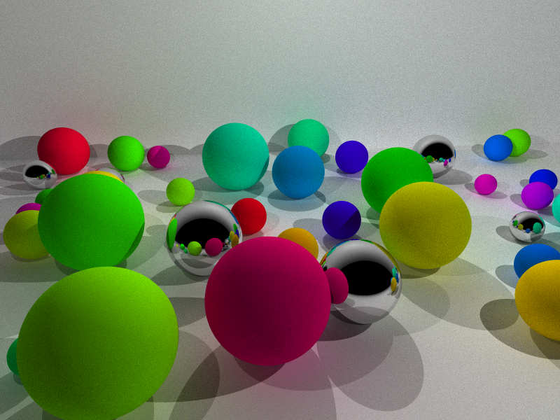
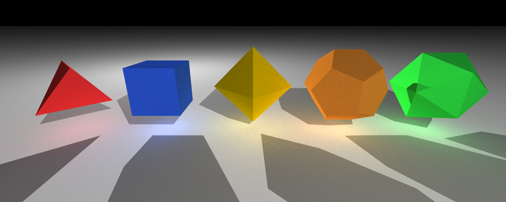
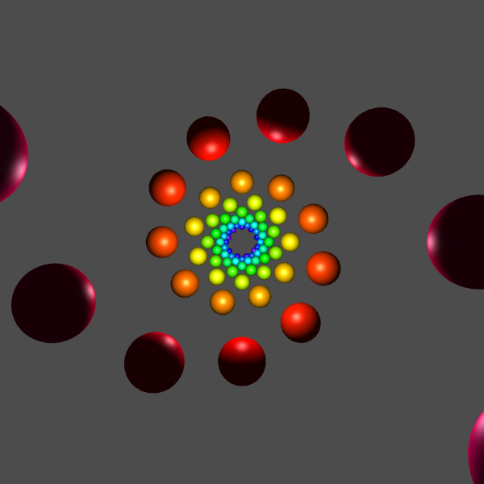
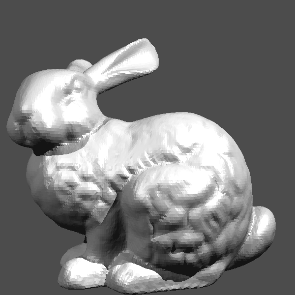
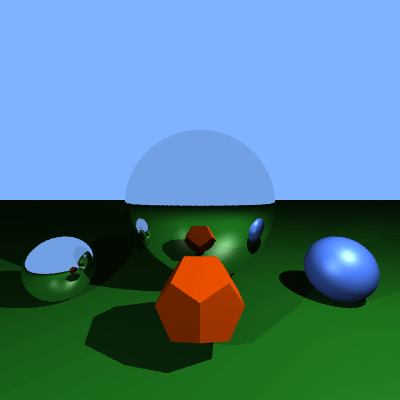
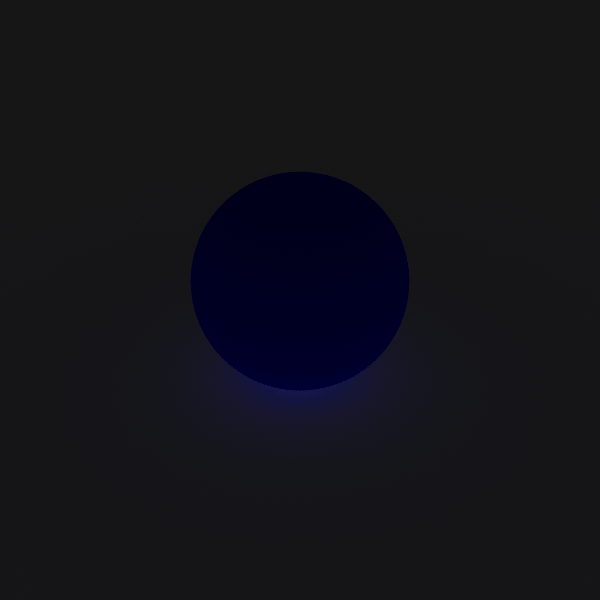

# CS5212 RayTracer

Raytracer built for UMD CS5212 Computer Graphics Course.

This is a simple ray tracer that supports:
- Output to PNG images
- Perspective Camera
- Sphere, Triangle, and Plane primitives
- Multiple shader implementations:
  - Simple (flat material colors)
  - Direct Lambertian shading with ambient light
  - Normal (surface normal visualization)
  - Blinn-Phong (diffuse + specular highlights)
  - Stochastic diffuse with diffuse Interreflection
  - Mirror (recursive reflections)
- Per-object shader overrides
- Jittered anti-aliasing
- Shadow casting
- Animated movie rendering via parameter sweeps

## Gallery

---

```sh
raytracer -p random_spheres -s diffuse -w 800 -h 600 --rays-per-pixel 128 --shadows on --reflect-depth 3 --scene-param number_spheres=45 > diffuse1.png
```




---


```sh
raytracer -p platonic -s diffuse --rays-per-pixel 128 -w 1500 -h 600 > platonic.png
```




---

```sh
raytracer --width 600 --height 600 -p spiral -s blinnphong -a on --scene-param spiral_turns=55 --scene-param num_spheres=100 --scene-param t=0.15 --scene-param hue_shift=270 --rays-per-pixel 10 > spiral_blinn_phong.png
```



---

```sh
raytracer -w 600 -h 600 --shader blinnphong -p trilist --datafile data/trilist.dat --anti-aliasing off --threads 12 > img/trilist.png && imv img/trilist.png
```



---


```sh
./render_movie.sh --param mirror_sphere_height --min 2.0 --max 8.0 --frames 120 --preset mixed_shader --shader blinnphong --width 400 --height 400 --fps 30 --aa on --output mirror.gif
```



---

```sh
./render_movie.sh --param t --min 0.0 --max 1.0 --frames 120 --preset shadow_demo --shader diffuse --width 600 --height 600 --fps 30 --output shadow.gif -- --rays-per-pixel 128
```



## Building the Project

The project uses CMake with vcpkg for dependency management. You need:
- A C++20 compiler
- CMake 3.22+
- vcpkg (for managing dependencies)
- ffmpeg (optional, for movie rendering)

### Build steps

```bash
# Configure with vcpkg toolchain
cmake -B buildVCPkg -S . \
  -DCMAKE_TOOLCHAIN_FILE=<path-to-vcpkg>/scripts/buildsystems/vcpkg.cmake

# Build
cmake --build buildVCPkg

```
The raytracer binary will be at `buildVCPkg/src/raytracer`.

## Running Tests

Unit tests use the [Catch2](https://github.com/catchorg/Catch2) framework and cover core primitives (vec, Ray, Sphere, Triangle, FrameBuffer).

```bash
# Run all tests
cd buildVCPkg && ctest

# Run all tests with output shown
cd buildVCPkg && ctest --output-on-failure

# Run a specific test
cd buildVCPkg && ctest -R utest_Sphere
```

## Using the raytracer command-line application

The renderer outputs PNG data to stdout. Redirect it to a file or pipe it to an image viewer.

### Basic usage

```bash
# Render with defaults (800x800, test scene, simple shader)
./buildVCPkg/src/raytracer > output.png

# Specify dimensions
./buildVCPkg/src/raytracer -w 1024 -h 768 > output.png
```

### Selecting a scene preset

Use `-p` or `--scene-preset` to choose a built-in scene:

```bash
# All five Platonic solids on a checkerboard
./buildVCPkg/src/raytracer -p platonic -s blinnphong -w 1200 -h 600 > platonic.png

# Dodecahedron with colored lights
./buildVCPkg/src/raytracer -p dodecahedron -s lambertian > dodecahedron.png

# Spiral of 500 spheres
./buildVCPkg/src/raytracer -p spiral -s lambertian -w 800 -h 800 > spiral.png

# Mixed shader demo (per-object shader overrides)
./buildVCPkg/src/raytracer -p mixed_shader -s blinnphong > mixed.png

# Shadow demo with three colored lights
./buildVCPkg/src/raytracer -p shadow_demo -s blinnphong > shadows.png

```

Available presets: `test`, `lit_test`, `single_sphere`, `grid`, `aligned`, `spiral`, `pyramid`, `octahedron`, `dodecahedron`, `checkerboard`, `hexboard`, `platonic`, `triangle_test`, `mixed_shader`, `shadow_demo`, `hall_of_mirrors`.

### Selecting a shader

Use `-s` or `--shader` to choose the rendering algorithm:

```bash
# Flat material colors (no lighting)
./buildVCPkg/src/raytracer -p platonic -s render > flat.png

# Surface normal visualization (useful for debugging)
./buildVCPkg/src/raytracer -p platonic -s normalshader > normals.png

# Lambertian (diffuse) shading
./buildVCPkg/src/raytracer -p platonic -s lambertian > lambertian.png

# Blinn-Phong shading (diffuse + specular highlights)
./buildVCPkg/src/raytracer -p platonic -s blinnphong > blinnphong.png

# Mirror shader (every surface reflects)
./buildVCPkg/src/raytracer -p checkerboard -s mirror --reflect-depth 8 > mirror.png
```

Available shaders: `render`, `normalshader`, `lambertian`, `blinnphong`, `mirror`.

### Anti-aliasing

Anti-aliasing is on by default (8 rays per pixel). You can adjust or disable it:

```bash
# Disable anti-aliasing (fastest, but jagged edges)
./buildVCPkg/src/raytracer -p platonic -s blinnphong --anti-aliasing off > fast.png

# High-quality anti-aliasing (32 samples per pixel)
./buildVCPkg/src/raytracer -p platonic -s blinnphong --rays-per-pixel 32 > smooth.png
```

### Shadows

Shadow casting is on by default. Disable with `--shadows off`:

```bash
# Compare with and without shadows
./buildVCPkg/src/raytracer -p shadow_demo -s blinnphong > with_shadows.png
./buildVCPkg/src/raytracer -p shadow_demo -s blinnphong --shadows off > no_shadows.png
```

### Scene parameters

Some presets accept numeric parameters via `--scene-param key=value`:

```bash
# Spiral scene: position the camera at 50% along the spiral
./buildVCPkg/src/raytracer -p spiral -s diffuse --scene-param t=0.5 > spiral_mid.png

# Spiral scene: customize sphere count and turns
./buildVCPkg/src/raytracer -p spiral -s diffuse \
  --scene-param num_spheres=200 \
  --scene-param spiral_turns=30 \
  --scene-param t=0.3 > spiral_custom.png

# Mixed shader scene: adjust the mirror sphere height
./buildVCPkg/src/raytracer -p mixed_shader -s blinnphong \
  --scene-param mirror_sphere_height=3.0 > mixed_low.png
```

### Full options reference

Run `./buildVCPkg/src/raytracer --help` to see all options:

| Option | Short | Default | Description |
|--------|-------|---------|-------------|
| `--width` | `-w` | 800 | Image width in pixels |
| `--height` | `-h` | 800 | Image height in pixels |
| `--scene-preset` | `-p` | test | Scene preset name |
| `--shader` | `-s` | render | Shader mode |
| `--anti-aliasing` | `-a` | on | Toggle anti-aliasing (on/off) |
| `--rays-per-pixel` | | 8 | Samples per pixel for AA |
| `--reflect-depth` | | 5 | Max mirror reflection bounces |
| `--shadows` | | on | Enable shadow casting (on/off) |
| `--scene-param` | | | Scene parameter as key=value |

## Creating Movies

The `render_movie.sh` script renders a sequence of frames by sweeping a scene parameter from a minimum to a maximum value, then encodes them into an MP4 video using ffmpeg.

### Basic usage

```bash
# Animate the mirror sphere height from 2 to 8
./render_movie.sh --param mirror_sphere_height --min 2.0 --max 8.0
```

This renders 60 frames at 800x600 using the `mixed_shader` preset with `blinnphong` shading, and produces `movie.mp4`.

### Customizing the render

```bash
# Higher resolution, more frames, with anti-aliasing
./render_movie.sh \
  --param mirror_sphere_height --min 1.0 --max 10.0 \
  --frames 120 \
  --width 1280 --height 720 \
  --aa on \
  --fps 24 \
  --output sphere_anim.mp4

# Animate camera position along the spiral scene
./render_movie.sh \
  --param t --min -0.1 --max 0.9 \
  --preset spiral --shader lambertian \
  --frames 300 --fps 60 \
  --output spiral_flythrough.mp4

# Animate hue shift in the spiral
./render_movie.sh \
  --param hue_shift --min 0 --max 360 \
  --preset spiral --shader lambertian \
  --frames 90 \
  --output hue_cycle.mp4
```

### Passing extra renderer flags

Use `--` to forward additional arguments to the renderer:

```bash
# Animate with higher reflection depth
./render_movie.sh \
  --param mirror_sphere_height --min 2.0 --max 8.0 \
  --preset mixed_shader --shader mirror \
  -- --reflect-depth 10
```

### All render_movie.sh options

| Option | Default | Description |
|--------|---------|-------------|
| `--param` | *(required)* | Scene parameter name to animate |
| `--min` | *(required)* | Starting value |
| `--max` | *(required)* | Ending value |
| `--frames` | 60 | Number of frames to render |
| `--preset` | mixed_shader | Scene preset |
| `--shader` | blinnphong | Shader mode |
| `--width` | 800 | Image width |
| `--height` | 600 | Image height |
| `--fps` | 30 | Output video frame rate |
| `--aa` | off | Anti-aliasing (on/off) |
| `--output` | movie.mp4 | Output video file path |
| `--renderer` | buildVCPkg/src/raytracer | Path to renderer binary |
| `--` | | Extra arguments passed to renderer |

