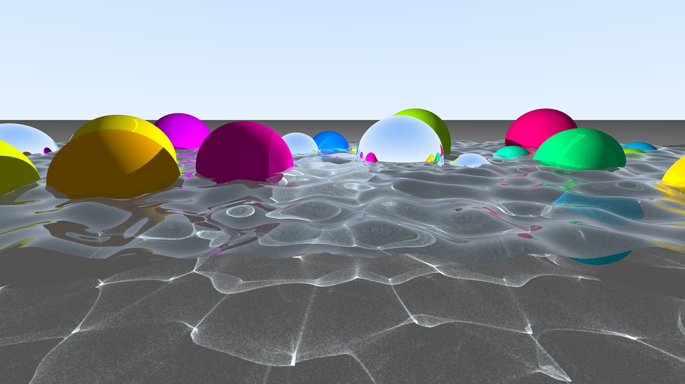
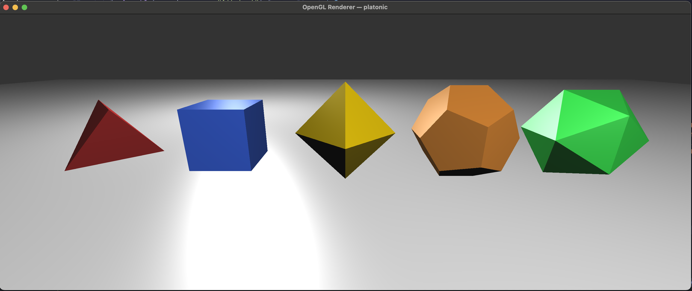

# CS5212 RayTracer

Raytracer built for UMD CS5212 Computer Graphics Course.

This is a simple ray tracer that supports:
- Output to PNG images
- Perspective Camera
- Sphere, Triangle, and Plane primitives
- Multiple shader implementations:
  - Simple (flat material colors)
  - Direct Lambertian shading with ambient light
  - Normal (surface normal visualization)
  - Blinn-Phong (diffuse + specular highlights)
  - Stochastic diffuse with diffuse Interreflection
  - Mirror (recursive reflections)
- Per-object shader overrides
- Jittered anti-aliasing
- Shadow casting
- Animated movie rendering via parameter sweeps

Also included is an **OpenGL renderer** (`openglRenderer`) that consumes the same `Scene` data structures and scene presets, but renders them through the GPU using rasterization. See [Using the OpenGL renderer](#using-the-opengl-renderer) below.

## Gallery

### Raytracer Examples

```sh
raytracer -p fresnel_random_spheres --shader diffuse --width 3840 --height 2160 \
  --rays-per-pixel 128 --shadows on --reflect-depth 3 \
  --photons 10000000 --caustic-extent 24 --caustic-grid 8192 --caustic-blur 1 \
  --scene-param number_spheres=30 --scene-param sphere_seed=43 \
  --scene-param water_size=24 --scene-param water_resolution=512 \
  --scene-param water_frequency=.75 --scene-param water_amplitude=0.3 \
  --scene-param water_z=4.0 --scene-param floor_z=2.0 \
  --scene-param cam_back=16.0 --scene-param cam_height=6.0 > out.png
```



See [FINAL.md](FINAL.md) for a full write-up of the Fresnel + photon-mapped-caustics scene.

---

```sh
raytracer -p random_spheres -s diffuse -w 800 -h 600 --rays-per-pixel 128 --shadows on --reflect-depth 3 --scene-param number_spheres=45 > diffuse1.png
```


---


```sh
raytracer -p platonic -s diffuse --rays-per-pixel 128 -w 1500 -h 600 > platonic.png
```


---

```sh
raytracer --width 600 --height 600 -p spiral -s blinnphong -a on --scene-param spiral_turns=55 --scene-param num_spheres=100 --scene-param t=0.15 --scene-param hue_shift=270 --rays-per-pixel 10 > spiral_blinn_phong.png
```


---

```sh
raytracer -w 600 -h 600 --shader blinnphong -p trilist --datafile data/trilist.dat --anti-aliasing off --threads 12 > img/trilist.png && imv img/trilist.png
```


### Raytracer Movie Examples


```sh
./render_movie.sh --param mirror_sphere_height --min 2.0 --max 8.0 --frames 120 --preset mixed_shader --shader blinnphong --width 400 --height 400 --fps 30 --aa on --output mirror.gif
```


---

```sh
./render_movie.sh --param t --min 0.0 --max 1.0 --frames 120 --preset shadow_demo --shader diffuse --width 600 --height 600 --fps 30 --output shadow.gif -- --rays-per-pixel 128
```


### Open GL Renderer Examples

The same scene presets and objects that are used in the raytracer can be rendered using openGL.  Here we render the same platonic scene as above but with BlinnPhong shading in the `openglRenderer`.

```sh
openGLRenderer -p platonic -s blinnphong -w 1500 -h 600
```




---

Flythrough of the spiral scene using interactive camera controls in the openglRenderer.  Spheres are shaded with Blinn-Phong and two lights are in the scene at either end of the spiral.

```sh
openGLRenderer -p spiral -s blinnphong --scene-param spiral_turns=110 --scene-param num_spheres=200 --scene-param t=0.5 --scene-param hue_shift=270
```

https://github.com/user-attachments/assets/54baecb0-f062-497b-8d84-823517937b26


## Building the Project

The project uses CMake with vcpkg for dependency management. You need:
- A C++20 compiler
- CMake 3.22+
- vcpkg (for managing dependencies)
- ffmpeg (optional, for movie rendering)

### Build steps

```bash
# Configure with vcpkg toolchain
cmake -B buildVCPkg -S . \
  -DCMAKE_TOOLCHAIN_FILE=<path-to-vcpkg>/scripts/buildsystems/vcpkg.cmake

# Build
cmake --build buildVCPkg

```
The build produces two binaries:
- `buildVCPkg/src/raytracer` — CPU raytracer, PNG output to stdout
- `buildVCPkg/OpenGL/openglRenderer` — real-time OpenGL viewer (interactive window)

## Running Tests

Unit tests use the [Catch2](https://github.com/catchorg/Catch2) framework and cover core primitives (vec, Ray, Sphere, Triangle, FrameBuffer).

```bash
# Run all tests
cd buildVCPkg && ctest

# Run all tests with output shown
cd buildVCPkg && ctest --output-on-failure

# Run a specific test
cd buildVCPkg && ctest -R utest_Sphere
```

## Using the raytracer command-line application

The renderer outputs PNG data to stdout. Redirect it to a file or pipe it to an image viewer.

### Basic usage

```bash
# Render with defaults (800x800, test scene, simple shader)
./buildVCPkg/src/raytracer > output.png

# Specify dimensions
./buildVCPkg/src/raytracer -w 1024 -h 768 > output.png
```

### Selecting a scene preset

Use `-p` or `--scene-preset` to choose a built-in scene:

```bash
# All five Platonic solids on a checkerboard
./buildVCPkg/src/raytracer -p platonic -s blinnphong -w 1200 -h 600 > platonic.png

# Dodecahedron with colored lights
./buildVCPkg/src/raytracer -p dodecahedron -s lambertian > dodecahedron.png

# Spiral of 500 spheres
./buildVCPkg/src/raytracer -p spiral -s lambertian -w 800 -h 800 > spiral.png

# Mixed shader demo (per-object shader overrides)
./buildVCPkg/src/raytracer -p mixed_shader -s blinnphong > mixed.png

# Shadow demo with three colored lights
./buildVCPkg/src/raytracer -p shadow_demo -s blinnphong > shadows.png

```

Available presets: `test`, `lit_test`, `single_sphere`, `grid`, `aligned`, `spiral`, `pyramid`, `octahedron`, `dodecahedron`, `checkerboard`, `hexboard`, `platonic`, `triangle_test`, `mixed_shader`, `shadow_demo`, `hall_of_mirrors`.

### Selecting a shader

Use `-s` or `--shader` to choose the rendering algorithm:

```bash
# Flat material colors (no lighting)
./buildVCPkg/src/raytracer -p platonic -s render > flat.png

# Surface normal visualization (useful for debugging)
./buildVCPkg/src/raytracer -p platonic -s normalshader > normals.png

# Lambertian (diffuse) shading
./buildVCPkg/src/raytracer -p platonic -s lambertian > lambertian.png

# Blinn-Phong shading (diffuse + specular highlights)
./buildVCPkg/src/raytracer -p platonic -s blinnphong > blinnphong.png

# Mirror shader (every surface reflects)
./buildVCPkg/src/raytracer -p checkerboard -s mirror --reflect-depth 8 > mirror.png
```

Available shaders: `render`, `normalshader`, `lambertian`, `blinnphong`, `mirror`.

### Anti-aliasing

Anti-aliasing is on by default (8 rays per pixel). You can adjust or disable it:

```bash
# Disable anti-aliasing (fastest, but jagged edges)
./buildVCPkg/src/raytracer -p platonic -s blinnphong --anti-aliasing off > fast.png

# High-quality anti-aliasing (32 samples per pixel)
./buildVCPkg/src/raytracer -p platonic -s blinnphong --rays-per-pixel 32 > smooth.png
```

### Shadows

Shadow casting is on by default. Disable with `--shadows off`:

```bash
# Compare with and without shadows
./buildVCPkg/src/raytracer -p shadow_demo -s blinnphong > with_shadows.png
./buildVCPkg/src/raytracer -p shadow_demo -s blinnphong --shadows off > no_shadows.png
```

### Scene parameters

Some presets accept numeric parameters via `--scene-param key=value`:

```bash
# Spiral scene: position the camera at 50% along the spiral
./buildVCPkg/src/raytracer -p spiral -s diffuse --scene-param t=0.5 > spiral_mid.png

# Spiral scene: customize sphere count and turns
./buildVCPkg/src/raytracer -p spiral -s diffuse \
  --scene-param num_spheres=200 \
  --scene-param spiral_turns=30 \
  --scene-param t=0.3 > spiral_custom.png

# Mixed shader scene: adjust the mirror sphere height
./buildVCPkg/src/raytracer -p mixed_shader -s blinnphong \
  --scene-param mirror_sphere_height=3.0 > mixed_low.png
```

### Full options reference

Run `./buildVCPkg/src/raytracer --help` to see all options:

| Option | Short | Default | Description |
|--------|-------|---------|-------------|
| `--width` | `-w` | 800 | Image width in pixels |
| `--height` | `-h` | 800 | Image height in pixels |
| `--scene-preset` | `-p` | test | Scene preset name |
| `--shader` | `-s` | render | Shader mode |
| `--anti-aliasing` | `-a` | on | Toggle anti-aliasing (on/off) |
| `--rays-per-pixel` | | 8 | Samples per pixel for AA |
| `--reflect-depth` | | 5 | Max mirror reflection bounces |
| `--shadows` | | on | Enable shadow casting (on/off) |
| `--scene-param` | | | Scene parameter as key=value |

## Using the OpenGL renderer

`openglRenderer` opens a GLFW window and renders the same scene presets as the raytracer, but in real time using OpenGL rasterization. The two binaries share `ScenePresets`, `Scene`, `Sphere`, `Triangle`, `Plane`, `Light`, and `Camera` — anything you can render with `raytracer -p <preset>` you can also render with `openglRenderer -p <preset>`.

The trade-offs are very different from the CPU raytracer:
- Real-time, interactive (fly around the scene with WASD + arrow keys)
- Only the rasterization-friendly shading models (Simple / Normal / Lambertian / Blinn-Phong)
- No path tracing, no recursive reflection / refraction, no shadows.

Materials whose `ShaderType` the OpenGL renderer can't honor (`MIRROR`, `DIELECTRIC`, `PATH_DIFFUSE`) fall back to **Blinn-Phong** using the material's diffuse color, so a scene like `checkerboard` (which features a mirror sphere) still renders — the mirror just appears as a shiny ball.

### Building

`openglRenderer` is built by the same CMake configure/build as the raytracer. The binary lands at `buildVCPkg/OpenGL/openglRenderer`. Shaders are auto-copied from `OpenGL/shaders/*.glsl` into the binary's directory at build time, so it can be run directly without manual setup.

```bash
cmake --build buildVCPkg --target openglRenderer
```

### Basic usage

```bash
# Default: opens an 800x800 window rendering the 'test' preset with Blinn-Phong shading
./buildVCPkg/OpenGL/openglRenderer

# Specify scene + window size
./buildVCPkg/OpenGL/openglRenderer -p platonic -w 1200 -h 700
```

### Selecting a scene preset

Same `-p` flag and same names as the raytracer:

```bash
./buildVCPkg/OpenGL/openglRenderer -p platonic
./buildVCPkg/OpenGL/openglRenderer -p pyramid
./buildVCPkg/OpenGL/openglRenderer -p mixed_shader
./buildVCPkg/OpenGL/openglRenderer -p spiral --scene-param num_spheres=200
```

### Selecting a shader

The `-s` flag picks the **default** shader applied to objects whose material doesn't already specify one. Per-material overrides in scene presets (e.g. `mixed_shader`) still take precedence:

```bash
./buildVCPkg/OpenGL/openglRenderer -p platonic -s blinnphong   # default
./buildVCPkg/OpenGL/openglRenderer -p platonic -s lambertian
./buildVCPkg/OpenGL/openglRenderer -p platonic -s normalshader
./buildVCPkg/OpenGL/openglRenderer -p platonic -s render        # flat color
```

The `mirror` and `diffuse` shader names from the raytracer are accepted but warn and fall back to `blinnphong`.

### Camera controls (fly camera)

The window opens with the camera placed by the scene preset; from there you can move freely:

| Key | Action |
|-----|--------|
| `W` / `S` | fly forward / backward (camera-relative) |
| `A` / `D` | strafe left / right |
| `Space` / `LeftShift` | fly up / down (world-relative) |
| `←` `→` | yaw left / right |
| `↑` `↓` | pitch up / down |
| `ESC` | quit |

Default speeds: 5 units/sec translate, 90°/sec yaw, 60°/sec pitch.

### Sphere fidelity

Spheres are tessellated as **icospheres** (icosahedron with midpoint subdivision); the default subdivision level is 2 → 320 triangles per sphere. This is hard-coded in `OpenGL/GLSceneRenderer.cpp` (`kIcoSphereSubdivisions`).

### Plane rendering

`Plane`s are mathematically infinite; the OpenGL renderer draws each as a 100×100 quad oriented to the plane's normal at its `point`. Pattern selection (`SOLID` / `CHECKER` / `HEX`) is implemented in `fragmentShader_plane.glsl` using the same world-space math the raytracer uses, so the patterns line up identically with the raytracer at non-extreme camera distances. Far-away planes will visibly truncate at the 100-unit edge.

### Lights

The OpenGL shaders support up to **4 lights** as a per-fragment uniform array. Light intensity is honored (a `(0.5, 0.5, 0.5)` fill light contributes half as much as a `(1, 1, 1)` key light). All scene presets in this repo use 1–3 lights, so no preset hits the cap. To raise it, bump `kMaxLights` in `OpenGL/SceneBridge.h` and `MAX_LIGHTS` in the three lit fragment shaders to match.

### Full options reference

Run `./buildVCPkg/OpenGL/openglRenderer --help` to see all options:

| Option | Short | Default | Description |
|--------|-------|---------|-------------|
| `--width` | `-w` | 800 | Window width in pixels |
| `--height` | `-h` | 800 | Window height in pixels |
| `--scene-preset` | `-p` | test | Scene preset name |
| `--shader` | `-s` | blinnphong | Default shader: `render`, `normalshader`, `lambertian`, `blinnphong` |
| `--scene-param` | | | Scene parameter as `key=value` (composable) |
| `--datafile` | `-d` | | Path to triangle data file (used with `-p trilist`) |

## Feature comparison: raytracer vs openglRenderer

Both binaries operate on the same `Scene` data and accept the same `--scene-preset` / `--scene-param` / `-w` / `-h` / `-d` options.

| Feature | `raytracer` (CPU) | `openglRenderer` (GPU) |
|---|---|---|
| **Output** | PNG to stdout | Live GLFW window |
| **Speed** | Seconds–minutes per frame | Real time (60+ fps) |
| **Interactivity** | None (offline) | Fly camera (WASD + arrows + Space/Shift) |
| **Scene presets** | All | All (uses identical `ScenePresets::loadScene`) |
| `render` (Simple) shader | ✔ | ✔ |
| `normalshader` | ✔ | ✔ |
| `lambertian` | ✔ | ✔ |
| `blinnphong` | ✔ | ✔ |
| `mirror` shader | ✔ recursive reflection | ✘ falls back to Blinn-Phong |
| `diffuse` shader (path-traced indirect) | ✔ | ✘ falls back to Blinn-Phong |
| Refraction / dielectrics | ✔ | ✘ falls back to Blinn-Phong |
| Caustics (photon map) | ✔ via `--photons` | ✘ |
| Shadow casting | ✔ via `--shadows on/off` | ✘ |
| Anti-aliasing | ✔ jittered, `--rays-per-pixel` | ✘ (not supported) |
| Gamma correction on output | ✔ via `--gamma` | ✘ (writes to default framebuffer) |
| Per-object shader overrides | ✔ honored | ✔ honored (with fallbacks above) |
| Multiple lights | ✔ unlimited | ✔ up to 4 (per-fragment uniform array) |
| Plane primitive | ✔ infinite | ✔ rendered as 100×100 quad with procedural pattern |
| Sphere primitive | ✔ analytic intersection | ✔ icosphere mesh (level-2 → 320 triangles) |
| Triangle primitive | ✔ Möller-Trumbore | ✔ direct VBO upload |
| Per-vertex normals (smooth shading) | ✔ | ✔ (via per-fragment lighting) |
| Plane CHECKER / HEX patterns | ✔ | ✔ (procedural in fragment shader) |
| Movie rendering (`render_movie.sh`) | ✔ | ✘ (interactive only) |
| Background color from scene | ✔ | ✔ via `glClearColor` |
| `is_caustic_receiver` flag | ✔ honored | ✘ ignored |

If you want to compare a raytracer image against the OpenGL view of the same scene side-by-side:

```bash
./buildVCPkg/src/raytracer       -p platonic -s blinnphong > platonic_rt.png && imv platonic_rt.png &
./buildVCPkg/OpenGL/openglRenderer -p platonic -s blinnphong &
```

## Creating Movies

The `render_movie.sh` script renders a sequence of frames by sweeping a scene parameter from a minimum to a maximum value, then encodes them into an MP4 video using ffmpeg.

### Basic usage

```bash
# Animate the mirror sphere height from 2 to 8
./render_movie.sh --param mirror_sphere_height --min 2.0 --max 8.0
```

This renders 60 frames at 800x600 using the `mixed_shader` preset with `blinnphong` shading, and produces `movie.mp4`.

### Customizing the render

```bash
# Higher resolution, more frames, with anti-aliasing
./render_movie.sh \
  --param mirror_sphere_height --min 1.0 --max 10.0 \
  --frames 120 \
  --width 1280 --height 720 \
  --aa on \
  --fps 24 \
  --output sphere_anim.mp4

# Animate camera position along the spiral scene
./render_movie.sh \
  --param t --min -0.1 --max 0.9 \
  --preset spiral --shader lambertian \
  --frames 300 --fps 60 \
  --output spiral_flythrough.mp4

# Animate hue shift in the spiral
./render_movie.sh \
  --param hue_shift --min 0 --max 360 \
  --preset spiral --shader lambertian \
  --frames 90 \
  --output hue_cycle.mp4
```

### Passing extra renderer flags

Use `--` to forward additional arguments to the renderer:

```bash
# Animate with higher reflection depth
./render_movie.sh \
  --param mirror_sphere_height --min 2.0 --max 8.0 \
  --preset mixed_shader --shader mirror \
  -- --reflect-depth 10
```

### All render_movie.sh options

| Option | Default | Description |
|--------|---------|-------------|
| `--param` | *(required)* | Scene parameter name to animate |
| `--min` | *(required)* | Starting value |
| `--max` | *(required)* | Ending value |
| `--frames` | 60 | Number of frames to render |
| `--preset` | mixed_shader | Scene preset |
| `--shader` | blinnphong | Shader mode |
| `--width` | 800 | Image width |
| `--height` | 600 | Image height |
| `--fps` | 30 | Output video frame rate |
| `--aa` | off | Anti-aliasing (on/off) |
| `--output` | movie.mp4 | Output video file path |
| `--renderer` | buildVCPkg/src/raytracer | Path to renderer binary |
| `--` | | Extra arguments passed to renderer |

